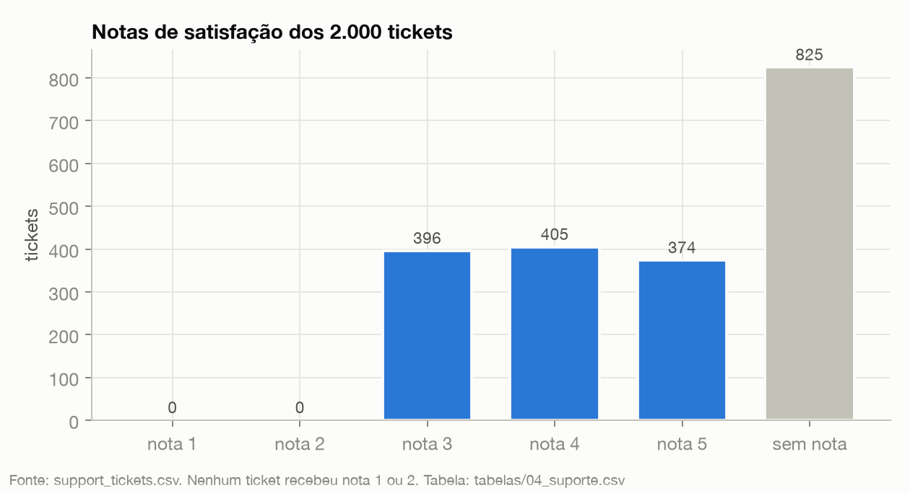

# Submissão — Adriel Porto — Challenge 001

**Diagnóstico de Churn — RavenStack** · [Ler o relatório completo →](./solution/RELATORIO_DIAGNOSTICO_CHURN.md)



Esta é a imagem que resume o diagnóstico. O CS diz que a satisfação está ok — e está. **Ela não tem como não estar: em 2.000 tickets não existe uma única nota 1 ou 2**, e 41% dos tickets não têm nota nenhuma. A empresa está medindo o próprio termômetro errado.

---

## Por onde começar

| Se você tem | Leia |
|---|---|
| **2 minutos** | O resumo abaixo |
| **15 minutos** | [`solution/RELATORIO_DIAGNOSTICO_CHURN.md`](./solution/RELATORIO_DIAGNOSTICO_CHURN.md) — as 3 perguntas do desafio, respondidas |
| **Quer ver como eu trabalhei** | [`process-log/`](./process-log/) — os 15 momentos de decisão, com o print da tela e o que pedi em cada um |
| **Quer ler a narrativa** | [`process-log/COMO-TRABALHEI.md`](./process-log/COMO-TRABALHEI.md) — iterações, os 4 erros e o que descartei |
| **Quer conferir os números** | [`solution/COMO-RODAR.md`](./solution/COMO-RODAR.md) — roda na sua máquina e reproduz cada número |

---

## Sobre mim

- **Nome:** Adriel Porto
- **LinkedIn:** https://www.linkedin.com/in/adrielportoribeiro/
- **Challenge escolhido:** 001 — Diagnóstico de Churn

---

## Executive Summary

O CEO disse que algo não batia: o churn subiu, o CS diz que a satisfação está ok, o produto diz que o uso cresceu. **Os três estão certos — e é exatamente por isso que ninguém enxerga o problema.**

O churn subiu de verdade: **14,4% do MRR ativo terminou encerrado no 4º trimestre de 2024**, contra 2,6% a 3,9% nos trimestres anteriores. A satisfação "está ok" porque a pesquisa não consegue registrar insatisfação. E o uso "cresceu" 1,1% em dois anos, ou seja, ficou parado.

**A causa raiz não é um segmento nem um motivo: é a medição.** "Churn" significa três coisas diferentes nos dados da empresa — 110, 352 e 45 contas, com apenas 6 em comum. A data do evento de churn coincide com o fim de uma assinatura em 6 de 600 casos. O motivo declarado e o comentário do cliente são estatisticamente independentes. Testei país, setor, canal, plano, tamanho, cobrança, renovação, upgrade, downgrade, suporte e uso: **nenhum separa quem sai de quem fica.**

Dois padrões sobrevivem aos testes: **conta nova sai mais** (32,6% contra 17,2%) e **o dinheiro está concentrado** — as assinaturas acima de US$ 5 mil/mês são 16% dos cancelamentos e **59% do MRR perdido**; 30 contas respondem por 45,5% de tudo que saiu.

**O que dá para fazer amanhã:** a lista das 25 contas prioritárias, com US$ 61,5 mil de MRR em risco por trimestre, está pronta em [`solution/tabelas/12_contas_em_risco_31dez2024.csv`](./solution/tabelas/12_contas_em_risco_31dez2024.csv) — abre no Excel, sem ferramenta nenhuma. Depois disso: uma definição única de churn, sem a qual nenhuma meta de retenção é auditável. As 6 ações, com prazo e premissa, estão no §4 do relatório.

**O que eu não entrego:** um modelo que preveja churn. Treinei um com 35 variáveis e validação no tempo: **AUC 0,525, não prevê melhor que o acaso** — a idade da conta sozinha ordena melhor que as 35 juntas. Deixei o modelo que falhou dentro da entrega, com o resultado à mostra. Com os campos atuais, um modelo de "90% de acerto" seria mentira bem apresentada.

---

## Process Log — como usei IA

> Narrativa completa, com horários e as iterações: [`process-log/COMO-TRABALHEI.md`](./process-log/COMO-TRABALHEI.md)

**Ferramentas:** Claude Code (construir as ferramentas e os 14 scripts; em duas sessões paralelas) · PromptCapture AI, ferramenta minha anterior ao desafio, que gravou o processo com print a cada 2 s + OCR + anotação por IA via Amazon Bedrock · API do Kaggle.

**A decisão que definiu tudo:** a primeira coisa que olhei foi o formato do dado, não o churn — e `subscriptions.csv` não é uma linha por conta, são ~10 assinaturas por conta, às vezes duas ativas ao mesmo tempo. Num dado assim, pedir "ache a causa raiz" para a IA é convidar uma correlação bonita e inconferível. Inverti: **eu defino a regra de cálculo, a IA implementa, e a ferramenta recalcula do CSV bruto toda vez.** A metodologia fica no código, auditável, não dentro de um parágrafo de resposta.

### Onde a IA errou e como corrigi

1. **"A taxa está estável em ~5%"** — a primeira versão da análise dividia os cancelamentos pelo total de assinaturas ativas. Como cada conta tem várias ao mesmo tempo, esse divisor cresce mais rápido que a base e **achata a curva**. Refeito por conta e por MRR: 14,4% no 4º tri. Foi o erro mais caro.
2. **Uma pizza mostrando 0 conta cancelada** num dataset com 600 eventos de churn — o código perguntava "a conta tem alguma linha cobrindo o último mês?", e com assinaturas sobrepostas quase toda conta passava. Corrigido para olhar a assinatura mais recente: 454 ativas / 46 canceladas.
3. **Números da ferramenta conferidos fora do navegador**, rodando o mesmo código por fora: 2 erros de contagem.
4. **Um erro que foi meu, não da IA:** apaguei o cabeçalho do CSV durante o teste de validação. Registrei junto — quem só registra o erro da ferramenta está montando álibi, não log.

### O que eu adicionei que a IA sozinha não faria

1. **Desconfiei da origem do cliente antes de olhar a tabela.** Uma IA que recebe 5 tabelas analisa as 5 tabelas; ela não pergunta "e se a origem estiver marcada errada?", porque nunca perdeu dinheiro com atribuição errada. Eu já perdi — são 10 anos fazendo tráfego pago. Simulei os dois cenários com o dado real: o mesmo investimento vira US$ 946 mil ou US$ 3,74 milhões de lucro dependendo só da marcação. Está em [`docs/ORIGEM_TRAFEGO_E_ATRIBUICAO.md`](./docs/ORIGEM_TRAFEGO_E_ATRIBUICAO.md).
2. **Medi cancelamento por valor, não por quantidade.** É a diferença entre "perdemos 101 assinaturas pequenas" e "perdemos 67 que valem 59% do dinheiro".
3. **Publiquei o modelo que falhou** e a lista do que os dados **não** sustentam — não cortar canal, não mexer em preço por país, não tratar upgrade como sinal de churn. É onde a maioria das análises inventa recomendação.

---

## Limitações

- **O dataset é declaradamente fictício** (o autor diz no Kaggle que foi gerado em Python/ChatGPT, com casos-limite plantados). Não dá para separar "não há sinal neste negócio" de "o gerador não criou sinal".
- **Dezembro/2024 é o último mês da base** e o mês com mais assinaturas novas — parte do pico do 4º trimestre pode ser efeito de fim de base.
- **Tudo aqui é correlação.** Nenhum teste estabelece causa.
- **Sem `scipy` na máquina**, os testes do cruzamento foram implementados à mão e não conferidos contra a biblioteca. Sem correção para múltiplas comparações em ~45 testes.
- Lista completa no §7 do relatório.

---

## O que tem nesta pasta

```
solution/     o relatório, as 12 tabelas que o sustentam, os 14 scripts que geram
              cada número, e 2 ferramentas que recalculam tudo ao vivo do CSV bruto
process-log/  os momentos de decisão com print e conversa, a narrativa, e as 30 imagens
docs/         a análise de origem de tráfego e a conciliação dos números
```

**Evidências de uso de IA**, todas em [`process-log/`](./process-log/):

- **Os momentos de decisão** — 15 blocos com a hora, o print da tela e o que eu pedi com as minhas palavras ([abre direto](./process-log/))
- **Chat export** — a conversa exata desses momentos, extraída do transcript da sessão do Claude Code ([ver](./process-log/chat-export/CONVERSA-NOS-MOMENTOS-DE-DECISAO.md))
- **30 screenshots** da sessão gravada, baixáveis ([pasta](./process-log/screenshots/)), mais uma [galeria em HTML](./process-log/linha-do-tempo.html) para abrir no computador
- **Narrativa escrita** ([COMO-TRABALHEI.md](./process-log/COMO-TRABALHEI.md)) e o **histórico de commits** desta branch, com o motivo de cada decisão na mensagem
- **Os 14 scripts** com a saída bruta salva, reproduzíveis a partir de `solution/`

A sessão gerou 8.058 prints; publiquei 30. Em 5 deles o painel direito do terminal mostrava uma lista de atalhos pessoais com endereços de e-mail — foram cortados para o painel da esquerda, onde está o trabalho.

---

_Submissão enviada em: 23/09/2026_
