# Process log — os momentos de decisão

Esta página é a porta de entrada do process log. Cada bloco abaixo é um momento em que alguma coisa mudou de rumo: **a hora, o print da tela naquele instante, e o que eu pedi com as minhas palavras.**

A sessão de 14/09/2026 foi gravada inteira pelo **PromptCapture AI** — uma ferramenta minha, anterior ao desafio, que tira um print a cada 2 segundos, lê a tela por OCR e manda uma IA no Amazon Bedrock anotar o passo. Foram **8.058 prints**. Ninguém revisa 8.058 prints, então filtrei pelos blocos que a própria IA marcou como `[DECISÃO]` e pelos que eu curei à mão: **30 publicados aqui**.

| | |
|---|---|
| 💬 **A conversa exata destes momentos** | [`chat-export/CONVERSA-NOS-MOMENTOS-DE-DECISAO.md`](./chat-export/CONVERSA-NOS-MOMENTOS-DE-DECISAO.md) — prompt e resposta na íntegra |
| 📖 **A narrativa do processo** | [`COMO-TRABALHEI.md`](./COMO-TRABALHEI.md) — ferramentas, iterações, os 4 erros, o que descartei |
| 🖼 **Todas as imagens** | [`screenshots/`](./screenshots/) — 30 arquivos, baixáveis |
| 🌐 **Galeria visual, abre com um clique** | **[porto-studio.github.io → linha do tempo](https://porto-studio.github.io/ai-master-challenge/submissions/adriel-porto/process-log/linha-do-tempo.html)** — a mesma coisa em página, com a grade das 30 imagens |

> **O que foi tirado destas imagens:** em 5 delas o painel da direita do terminal mostrava uma lista de atalhos pessoais com endereços de e-mail — essas foram cortadas para o painel da esquerda, que é onde está o trabalho. Uma sexta imagem, que era só a Mesa do computador sem conteúdo de trabalho, ficou de fora. Nada mais foi editado.

---

### 1. 14:54:44 — Abertura da sessão oficial

Abri a sessão dizendo que aquilo seria o registro oficial. Tudo o que vem depois foi gravado.

> *"vamos iniciar o challenge 001. entao essa será a sessao oficial na qual irei tentar manter as informaceos do que vou fazer do challeng do inicio ate o fim. leia a memoria do projeto, quero que tb a partir de agra tome cuidado com dados pessoais de clientes ou outras pessoas para nao aparecer…"*

[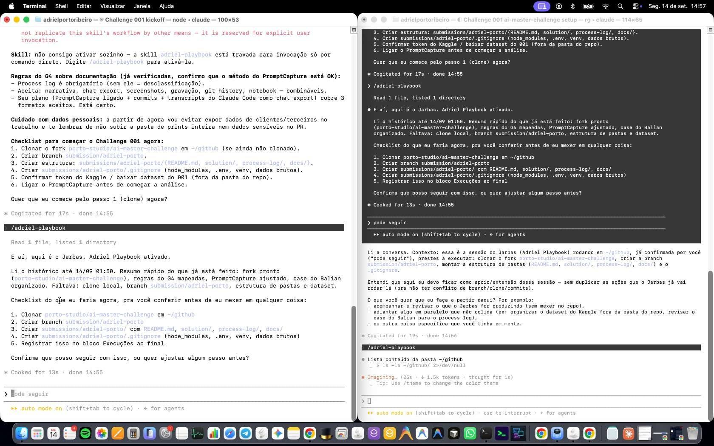](./screenshots/2026-09-14_14-57-12-615.jpg)

Print de 14:57:12 · [ver a conversa completa deste momento](./chat-export/CONVERSA-NOS-MOMENTOS-DE-DECISAO.md#1-145444-abertura-da-sessão-oficial)

---

### 2. 15:09:31 — A primeira hipótese, ditada antes de qualquer análise

Ditei a hipótese **antes** de olhar qualquer número — é o que permite, no fim, dizer se ela se confirmou ou não.

> *"vou fazer algumas anotacoes durante analise, apenas para salvar depois. Em relação ao cancelamento, o primeiro ponto é analisar, qual está sendo a frequência, em que período, e a exemplo, o cliente entrou no mês um. Qual está sendo a média de cancelamento dos clientes em um nível na média maior, o…"*

[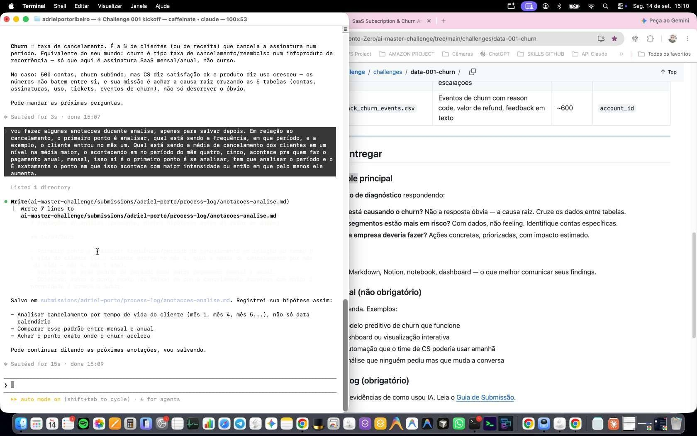](./screenshots/2026-09-14_15-10-16-633.jpg)

Print de 15:10:16 · [ver a conversa completa deste momento](./chat-export/CONVERSA-NOS-MOMENTOS-DE-DECISAO.md#2-150931-a-primeira-hipótese-ditada-antes-de-qualquer-análise)

---

### 3. 15:52:33 — O que eu queria saber dos dados

O que eu queria dos dados, em uma frase: quem comprou, quando, quanto paga e quando cancelou.

> *"Certo. Primeiro passo é saber os dados de quem comprou, quando comprou, qual valor paga por mes e quando cancelou. Entao preciso organizar esses dados de forma clara e LIMPA. porem como os dados estao baguncados eu tenho que tomar cuidado ao tentar usar a IA para ler os dados, pois pode alterar…"*

[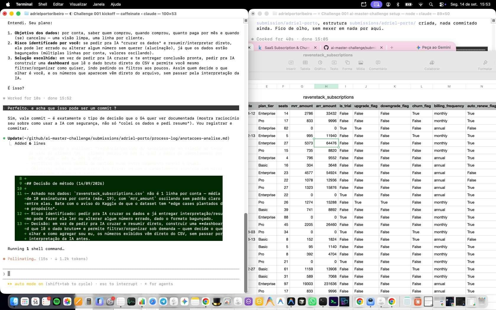](./screenshots/2026-09-14_15-53-40-464.jpg)

Print de 15:53:40 · [ver a conversa completa deste momento](./chat-export/CONVERSA-NOS-MOMENTOS-DE-DECISAO.md#3-155233-o-que-eu-queria-saber-dos-dados)

---

### 4. 15:53:24 — A decisão virar commit

Sete palavras que viraram o commit `395fc12`. A decisão de método virou registro no mesmo minuto.

> *"Perfeito. e acha que isso pode ser um commit ?"*

Print de 15:53:40 · [ver a conversa completa deste momento](./chat-export/CONVERSA-NOS-MOMENTOS-DE-DECISAO.md#4-155324-a-decisão-virar-commit)

---

### 5. 15:57:16 — A especificação da ferramenta, na minha voz

A especificação da ferramenta, ditada por voz. A IA não escolheu o que construir — eu descrevi e ela implementou.

> *"Então, eu quero que você crie um dashboard, que ele faça exatamente o que eu vou pedir, certo? Pode fazer de uma maneira que seja visualmente, bonito mas que seja eficiente né? Em que eu possa por exemplo, vamos começar pelo pelo. O dashboard, ele, eu vou ter que isso, importar o arquivo do pelo…"*

[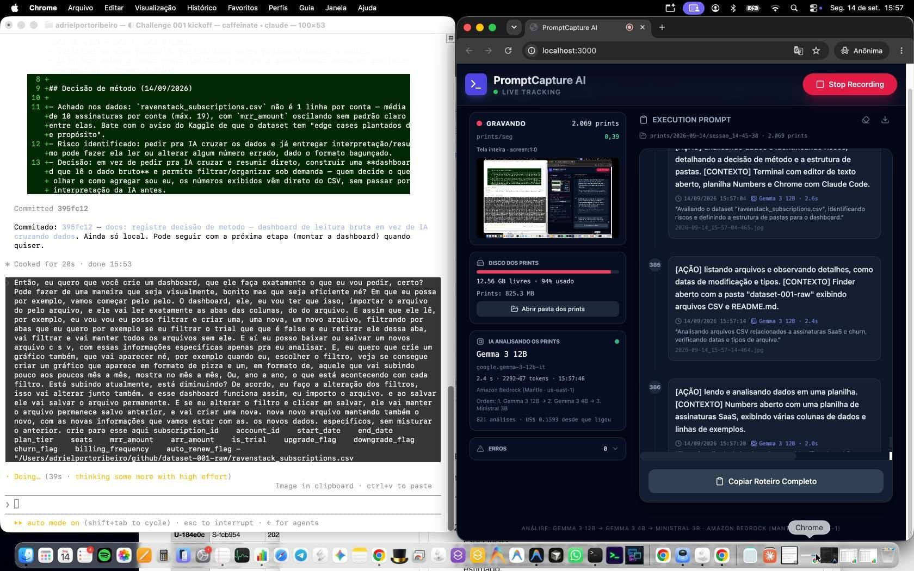](./screenshots/2026-09-14_15-57-55-520.jpg)

Print de 15:57:55 · [ver a conversa completa deste momento](./chat-export/CONVERSA-NOS-MOMENTOS-DE-DECISAO.md#5-155716-a-especificação-da-ferramenta-na-minha-voz)

---

### 6. 17:00:38 — O erro foi meu: apaguei o cabeçalho

O erro foi meu, não da IA: apaguei o cabeçalho do CSV durante a validação. Está aqui porque log que só mostra acerto não é log.

> *"Aqui acontece o seguinte olha, houve um erro meu. Eu fiz a planilha o dashboard, com os dados né, que a ela lê os dados reais então, beleza, só que mesmo assim eu fui conferir se ela realmente leu os dados reais né e o melhor jeito de eu conferir isso, por exemplo, retirando alguns arquivos pouco,…"*

[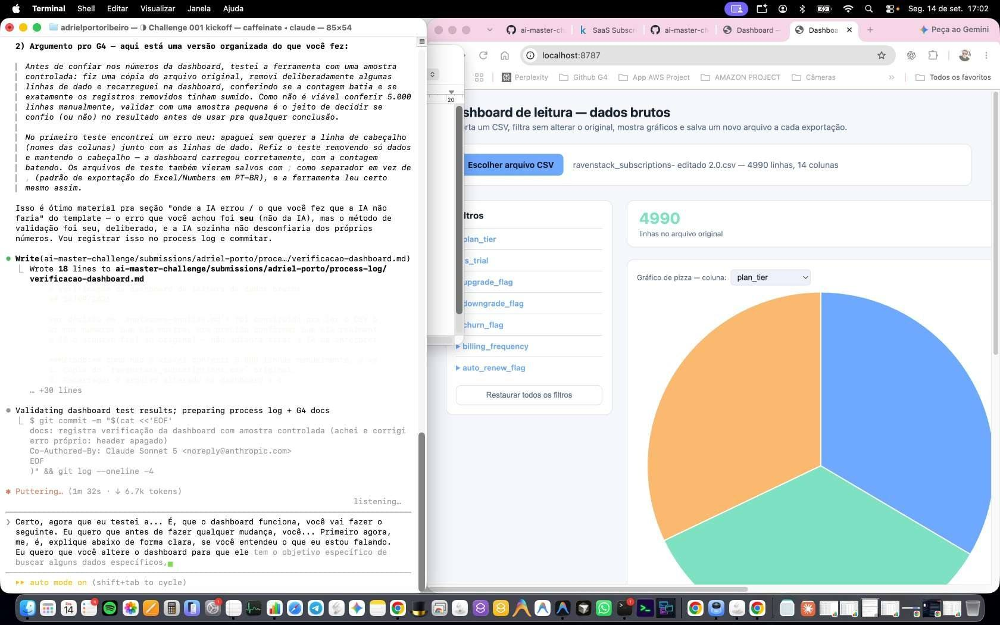](./screenshots/2026-09-14_17-02-10-643.jpg)

Print de 17:02:10 · [ver a conversa completa deste momento](./chat-export/CONVERSA-NOS-MOMENTOS-DE-DECISAO.md#6-170038-o-erro-foi-meu-apaguei-o-cabeçalho)

---

### 7. 17:08:57 — Testar a ferramenta antes de confiar nela

Testar a ferramenta antes de acreditar nela — amostra controlada, linhas removidas de propósito.

> *"Certo, agora que eu testei a... É, que o dashboard funciona, você vai fazer o seguinte. Eu quero que antes de fazer qualquer mudança, você... Primeiro agora, me, é, explique abaixo de forma clara, se você entendeu o que eu estou falando. Eu quero que você altere o dashboard para que ele tem o…"*

[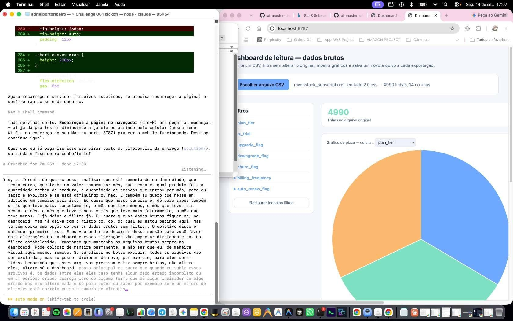](./screenshots/2026-09-14_17-07-20-547.jpg)

Print de 17:07:20 · [ver a conversa completa deste momento](./chat-export/CONVERSA-NOS-MOMENTOS-DE-DECISAO.md#7-170857-testar-a-ferramenta-antes-de-confiar-nela)

---

### 8. 17:15:04 — As regras de cálculo que eu defini

As regras de cálculo, definidas por mim: nunca alterar o dado bruto, upgrade/downgrade no dia exato, e cancelamento medido **por valor**.

> *"sobr e 1. Nunca alterar os CSVs brutos da pasta do GitHub. A mudança é só em como a dashboard lê, filtra e calcula " Não, eu não disse para alterar os brutos do GitHub. Mas também não é no caso, né? Eu tô falando que o dashboard que você criou agora, ele precisa para poder atualizar os dados e…"*

[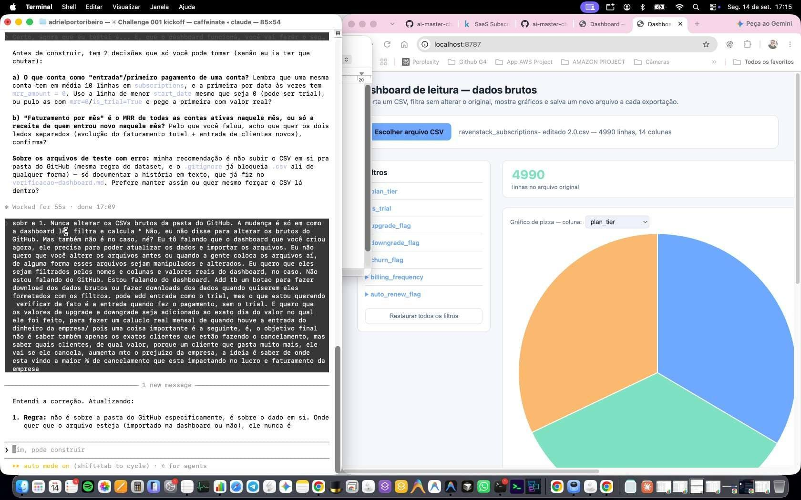](./screenshots/2026-09-14_17-15-54-551.jpg)

Print de 17:15:54 · [ver a conversa completa deste momento](./chat-export/CONVERSA-NOS-MOMENTOS-DE-DECISAO.md#8-171504-as-regras-de-cálculo-que-eu-defini)

---

### 9. 17:34:10 — A dúvida sobre recorrência que mudou o cálculo

A dúvida que mudou o cálculo: em recorrência, cancelar não devolve o mês passado. Isso muda como se conta o prejuízo.

> *"me tira uma dúvida. Se é um pagamento mensal, recorrência no caso, quando a pessoa faz um cancelamento, aquele valor ele não é retirado do mês, mas ele só não entra a mais, correto? Onde eu posso verificar essa informação? Não altere nada, apenas me diga onde você consegue verificar isso para mim."*

[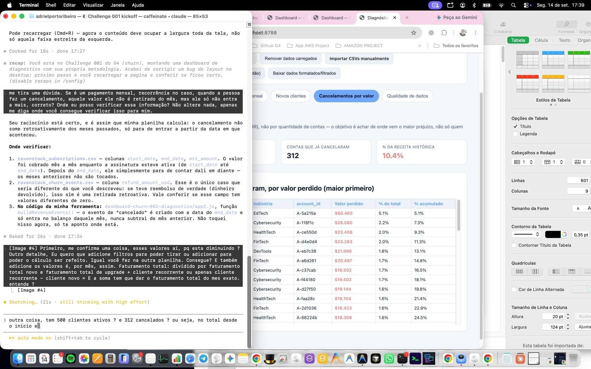](./screenshots/2026-09-14_17-39-36-538.jpg)

Print de 17:39:36 · [ver a conversa completa deste momento](./chat-export/CONVERSA-NOS-MOMENTOS-DE-DECISAO.md#9-173410-a-dúvida-sobre-recorrência-que-mudou-o-cálculo)

---

### 10. 19:39:39 — Analisar só com os filtros, sem manipular o dado

Pedi análise usando **só os filtros**, sem manipular o dado — para o número não passar por interpretação antes de chegar em mim.

> *"Seguinte, quero que voce faca uma analise e me responda aqui primeiro, analise o dashboard e APENAS usando os filtros do dashboard sem manipular os dodas voce consegue descobrir em uma linha temporal qual origem dos possivels motivos do churn ? comece de tras pra frente, analise quem fez chur e…"*

[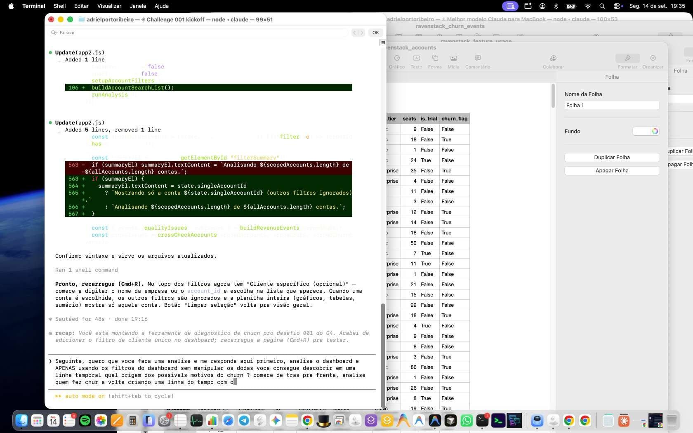](./screenshots/2026-09-14_19-35-05-565.jpg)

Print de 19:35:05 · [ver a conversa completa deste momento](./chat-export/CONVERSA-NOS-MOMENTOS-DE-DECISAO.md#10-193939-analisar-só-com-os-filtros-sem-manipular-o-dado)

---

### 11. 20:56:26 — A decisão de ir atrás da origem do tráfego

A decisão de parar a tabela e ir atrás da origem do tráfego. É o ponto em que minha experiência entrou no problema.

> *"Agora eu vou fazer uma análise que eu basicamente isso é uma opinião minha que eu poderia já parar por, por aqui apenas com essa análise para poder verificar o que eu vou dizer. Pois o que eu vou falar agora pode influenciar em todo o resto e primeiro eu tinha que verificar isso antes de qualquer…"*

[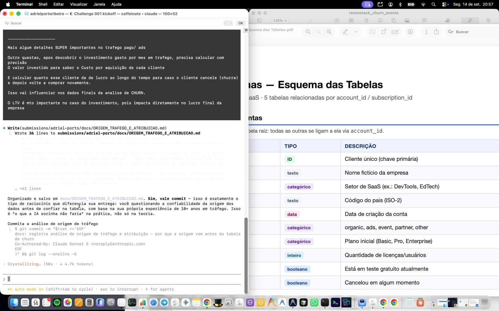](./screenshots/2026-09-14_20-57-17-570.jpg)

Print de 20:57:17 · [ver a conversa completa deste momento](./chat-export/CONVERSA-NOS-MOMENTOS-DE-DECISAO.md#11-205626-a-decisão-de-ir-atrás-da-origem-do-tráfego)

---

### 12. 21:01:30 — Provar o argumento com número

Provar o argumento com número em vez de opinião — virou o `dashboard-churn-005` e o commit `c54424e`.

> *"é, mais uma questão. Para provar que esse meu argumento se sustenta, eu preciso que você faça o seguinte. Eu queria uma mais um dashboard, faça uma cópia e crie um para usar os, apenas os dados das planilhas sem alterar nada. Onde a origem vai ser separada por origem do Ads e alguém que parta e…"*

[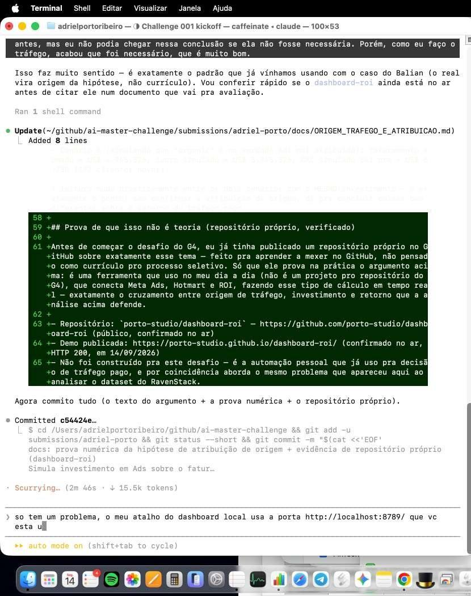](./screenshots/2026-09-14_21-09-15-567.jpg)

Print de 21:09:15 · [ver a conversa completa deste momento](./chat-export/CONVERSA-NOS-MOMENTOS-DE-DECISAO.md#12-210130-provar-o-argumento-com-número)

---

### 13. 21:16:17 — Comunicar para quem não é técnico

Pensando em quem vai ler: dono de empresa, não técnico. Planilha simples e relatório simples.

> *"Seguinte, o que, que eu vou fazer para facilitar o entendimento de tudo que eu estou mostrando, né? Primeiro ponto. Eu vou pegar esses cinco dashboards que eu fiz, né? Eu vou subir todos na Amazon, na AWS, na minha conta, no meu site, com a senha de acesso. E login. Para poder facilitar a…"*

[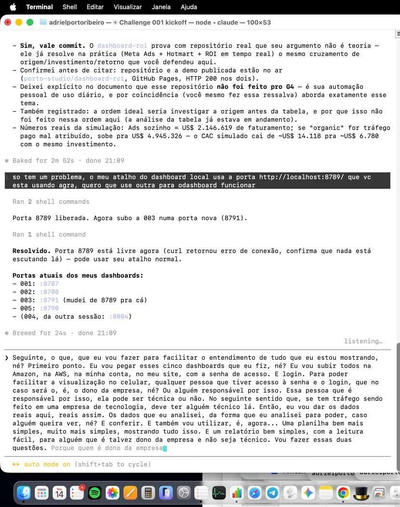](./screenshots/2026-09-14_21-11-47-564.jpg)

Print de 21:11:47 · [ver a conversa completa deste momento](./chat-export/CONVERSA-NOS-MOMENTOS-DE-DECISAO.md#13-211617-comunicar-para-quem-não-é-técnico)

---

### 14. 21:31:00 — Me avaliar contra os critérios do G4

Pedi para ser avaliado contra os critérios reais do G4 — e a resposta apontou que o deliverable principal ainda não existia.

> *"se fosse pra ser analisado a tomada de decidao de hoje dessa sessao com base no que o G4 gostaria de analisar, como seria ?"*

[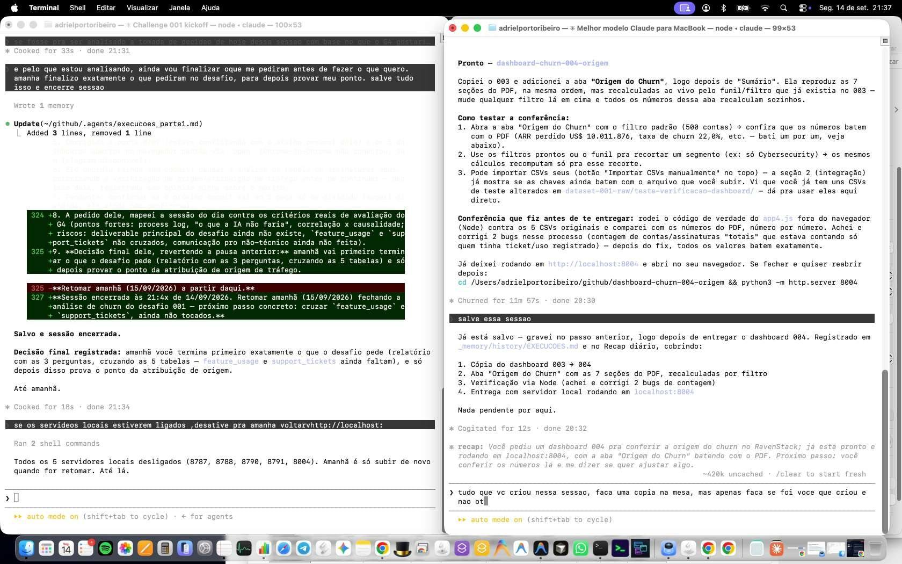](./screenshots/2026-09-14_21-37-23-832.jpg)

Print de 21:37:23 · [ver a conversa completa deste momento](./chat-export/CONVERSA-NOS-MOMENTOS-DE-DECISAO.md#14-213100-me-avaliar-contra-os-critérios-do-g4)

---

### 15. 21:33:49 — A decisão final: terminar o que o desafio pede primeiro

A decisão final do dia, revertendo a anterior: primeiro entregar exatamente o que o desafio pede.

> *"e pelo que estou analisando, ainda vou finalizar oque me pediram antes de fazer o que quero. amanha finalizo exatamente o que pediram no desafio, para depois provar meu ponto. salve tudo isso e encerre sessao"*

Print de 21:37:23 · [ver a conversa completa deste momento](./chat-export/CONVERSA-NOS-MOMENTOS-DE-DECISAO.md#15-213349-a-decisão-final-terminar-o-que-o-desafio-pede-primeiro)

---

## As outras imagens

Os 30 prints estão em [`screenshots/`](./screenshots/), nomeados por data e hora (`AAAA-MM-DD_HH-MM-SS`). Os que não aparecem acima são os passos intermediários entre uma decisão e outra.
