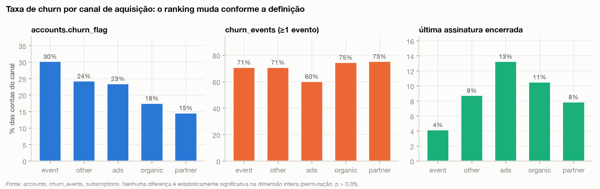
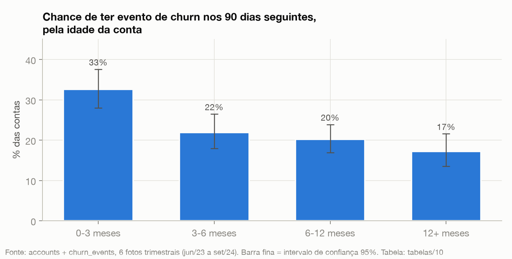
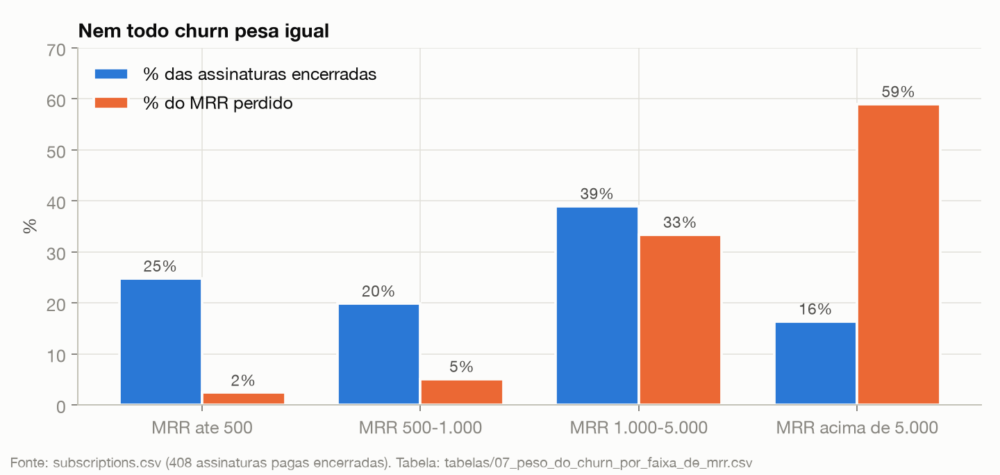
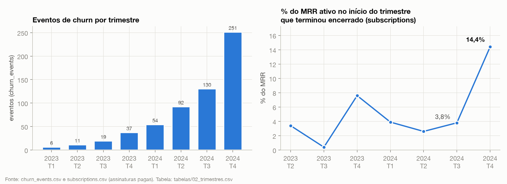
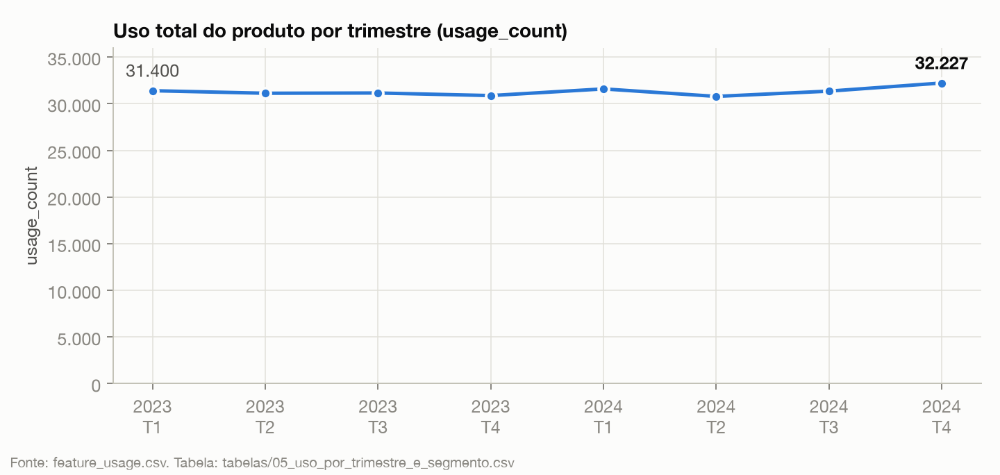

# Diagnóstico de Churn — RavenStack

**Base:** os 5 arquivos do dataset (500 contas, 5.000 assinaturas, 25.000 registros de uso, 2.000 tickets, 600 eventos de churn), de 01/2023 a 31/12/2024.
**Valores:** em US$. "MRR" = receita mensal recorrente (a mensalidade da assinatura). Todo número deste relatório sai de um script em `scripts/` e de uma tabela em `tabelas/`.
**Acompanham este relatório:** `cruzamento-uso-x-tickets/RESULTADO_CRUZAMENTO.md` (o cruzamento entre uso e suporte, ~45 testes), `../docs/CONCILIACAO-DOS-NUMEROS.md` (por que alguns números diferem entre os documentos desta submissão) e `COMO-RODAR.md` (como reproduzir cada número).

---

## Resumo para o CEO

O CEO disse: *"o churn subiu, o CS diz que a satisfação está ok, o produto diz que o uso cresceu. Algo não bate."*
Os dados mostram por que não bate:

| O que cada time diz | O que os dados mostram |
|---|---|
| **"O churn subiu"** | **Verdade no último trimestre.** No 4º tri/2024, 14,4% do MRR ativo no início do trimestre terminou encerrado. Nos três trimestres anteriores foram 2,6% a 3,9%. Só dezembro/2024 respondeu por 6,8%. |
| **"A satisfação está ok"** | **A medição não consegue mostrar insatisfação.** Nos 2.000 tickets **não existe nenhuma nota 1 ou 2**: só 3, 4 e 5. E 41% dos tickets não têm nota. A média de 3,98 é igual entre quem saiu e quem ficou. |
| **"O uso cresceu"** | **No total, não.** O uso ficou estável: +1,1% de 2023 para 2024. Alguns segmentos cresceram e outros caíram. E o dado de uso não está ligado ao período das assinaturas: 77,7% dos registros caem fora da vida da própria assinatura. |

**Resposta curta às três perguntas:**

1. **Causa raiz:** a empresa não consegue ver por que perde clientes porque **os registros que deveriam explicar o churn não concordam entre si nem com a realidade das assinaturas**: quem saiu (3 definições diferentes), por que saiu (motivo e comentário independentes), se estava satisfeito (escala sem notas 1 e 2) e se usava o produto (uso fora do período da assinatura). Testei país, setor, canal, plano, tamanho, cobrança, renovação automática, upgrade, downgrade, suporte e uso, e nenhum separa quem sai de quem fica. Só dois padrões se sustentam nos dados:
   - **conta nova sai mais**: 32,6% das contas com menos de 3 meses têm evento de churn nos 90 dias seguintes, contra 17,2% das contas com mais de 12 meses;
   - **o dinheiro perdido está concentrado**: as assinaturas acima de US$ 5 mil/mês são 16% dos cancelamentos e 59% do MRR perdido.
2. **Segmentos em risco:** contas com menos de 6 meses (em quantidade) e contas de MRR alto (em dinheiro). A lista das 25 contas prioritárias está na seção 3, e a lista completa das 500 em `tabelas/12_contas_em_risco_31dez2024.csv`.
3. **O que fazer:** (1) passar amanhã a lista das 25 contas para o CS; (2) criar uma definição única de churn em 30 dias; (3) rodar um programa de 90 dias para contas novas, com grupo de controle; (4) consertar a medição de satisfação, de motivo de saída e de uso. O impacto estimado de cada ação está na seção 4.

---

## 1. O que está causando o churn?

### 1.1 Primeiro achado: "churn" significa três coisas diferentes nos dados

| Onde o churn está registrado | Contas marcadas como churn |
|---|---|
| `accounts.churn_flag` | 110 (22,0%) |
| `churn_events` (pelo menos 1 evento) | 352 (70,4%) |
| `subscriptions`: a assinatura mais recente da conta está encerrada | 45 (9,0%) |
| `subscriptions`: a conta não tem nenhuma assinatura paga ativa em 31/12/2024 | **0** |

- Só **6 contas** aparecem como churn nas três definições ao mesmo tempo.
- A sobreposição entre duas definições vai de 8% a 19%.
- **As 110 contas com `churn_flag` continuam com assinatura paga ativa em 31/12/2024.**
- A data do churn coincide com o fim de uma assinatura da conta em só **6 dos 600** eventos. Em até 30 dias de diferença, são 126 dos 600.
- 284 das 352 contas com evento começaram assinaturas novas depois do último churn.

Tabela por conta: `tabelas/01_definicoes_de_churn_por_conta.csv`.

**Por que isso é causa raiz, e não detalhe técnico:** a conclusão sobre "quem cancela mais" muda conforme o arquivo usado.

| Canal | % churn pelo `churn_flag` | % churn pelo `churn_events` | % churn pela última assinatura encerrada |
|---|---|---|---|
| event | **30,2%** (maior) | 70,8% | **4,2%** (menor) |
| other | 24,3% | 70,9% | 8,7% |
| ads | 23,5% | **60,2%** (menor) | **13,3%** (maior) |
| organic | 17,5% | 74,6% | 10,5% |
| partner | **14,6%** (menor) | **75,3%** (maior) | 7,9% |
| p-valor da dimensão inteira (teste de permutação) | 0,082 | 0,140 | 0,236 |

O canal "event" é o pior numa definição e o melhor em outra. **Nenhuma das três diferenças é estatisticamente significativa.** Uma decisão como "cortar investimento no canal X" teria base em ruído.

### 1.2 Segundo achado: os campos que deveriam explicar o churn não são confiáveis

| Campo | O que foi verificado | Resultado |
|---|---|---|
| Motivo (`reason_code`) x comentário (`feedback_text`) | Os dois dizem a mesma coisa? | **Não.** São estatisticamente independentes (p = 0,988). O motivo "support" tem mais comentários "missing features" (31) do que qualquer outro texto. |
| Satisfação (`satisfaction_score`) | A escala vai de 1 a 5? | **Não.** Só existem as notas 3 (396), 4 (405) e 5 (374). Outros 825 tickets (41%) não têm nota. |
| Uso (`feature_usage`) | O uso acompanha a vida da assinatura? | **Não.** Toda assinatura tem cerca de 5 registros, dure 1 semana ou 2 anos (correlação −0,009). E 77,7% dos registros têm data fora do período da própria assinatura. |
| `preceding_upgrade_flag` | Bate com os upgrades em `subscriptions`? | **Não.** Dos 123 eventos marcados, só 34 têm upgrade em `subscriptions` nos 90 dias anteriores. Outros 111 eventos têm upgrade e não estão marcados. |
| `is_reactivation` | Bate com o histórico da conta? | **Não.** 248 eventos não são o primeiro da conta, mas só 35 deles estão marcados como reativação. Outros 26 eventos marcados não têm nenhum churn anterior. |

Os motivos declarados dividem o total quase igualmente (features 19,0%, support 17,3%, budget 17,3%, unknown 15,8%, competitor 15,3%, pricing 15,2%). Como o motivo não concorda com o comentário, essa divisão não indica causa.

Tabelas: `tabelas/04_suporte.csv`, `tabelas/11_motivo_x_comentario.csv`.

### 1.3 O que foi testado e NÃO explica o churn

**Suporte:** quem saiu e quem ficou são praticamente iguais.

| Tickets (histórico completo) | Contas com evento de churn | Contas sem evento |
|---|---|---|
| Satisfação média | 3,98 | 3,98 |
| % sem nota | 41,6% | 40,5% |
| % escalados | 5,1% | 4,0% |
| Tempo médio de resolução | 35,7 h | 36,1 h |
| Tickets por conta nos 90 dias antes do churn* | 0,53 | 0,52 |

\*Contas sem churn: os 90 dias antes de 31/12/2024.

**Perfil da conta e da assinatura:** comparei a perda de MRR em 2024 com as 4.207 assinaturas pagas que estavam ativas em algum momento do ano. No total, 10,0% do MRR foi perdido.

| Dimensão | Menor → maior % de MRR perdido | p-valor (quantidade / MRR) |
|---|---|---|
| País | IN 6,8% → FR 16,6% | 0,098 / 0,288 |
| Setor | FinTech 9,4% → Cybersecurity 11,6% | 0,623 / 0,825 |
| Canal | partner 8,7% → event 11,9% | 0,205 / 0,683 |
| Seats | 21-50 8,9% → 01-05 13,5% | 0,332 / 0,303 |
| Plano | Pro 8,2% → Enterprise 10,5% | 0,782 / 0,145 |
| Cobrança | anual 9,1% → mensal 10,8% | 0,223 / 0,284 |
| Renovação automática | não 8,9% → sim 10,3% | 0,903 / 0,464 |
| Teve upgrade | sim 7,0% → não 10,4% | 0,204 / 0,168 |
| Teve downgrade | sim 5,0% → não 10,2% | 0,512 / 0,165 |

**Nenhum p-valor fica abaixo de 0,05.** As diferenças da tabela estão dentro do que o acaso produz. Tabela: `tabelas/09_segmentos_mrr_perdido_2024.csv`.

**Upgrade ou downgrade antes do churn:** quem teve upgrade nos 90 dias anteriores teve evento de churn em 23,7% dos casos. Quem não teve, em 22,7%. Com downgrade são 26,8% contra 22,5%. A diferença é pequena e não sustenta a tese de que "o upgrade empurrado leva ao cancelamento".

### 1.4 Os dois padrões que se sustentam

**Padrão 1: conta nova sai mais.** Tirei 6 fotos trimestrais da base (de jun/2023 a set/2024) e medi quantas contas tiveram evento de churn nos 90 dias seguintes.

| Idade da conta | Contas observadas | % com evento em 90 dias | Intervalo de confiança 95% | % sem o 4º tri/2024 |
|---|---|---|---|---|
| 0-3 meses | 365 | **32,6%** | 28,0% – 37,6% | 27,3% |
| 3-6 meses | 347 | 21,9% | 17,9% – 26,5% | 18,8% |
| 6-12 meses | 511 | 20,2% | 16,9% – 23,9% | 17,9% |
| 12+ meses | 326 | **17,2%** | 13,5% – 21,6% | 16,5% |

- Os intervalos de "0-3 meses" e "12+ meses" não se cruzam.
- O padrão continua quando tiro o último trimestre, que é o mais atípico.
- Em 4 das 5 fotos comparáveis, contas com menos de 6 meses tiveram mais eventos que as mais velhas. A exceção foi set/2023: 14,0% contra 21,8%. A foto de jun/2023 não tem contas com mais de 6 meses. Na foto de set/2024, foram 45,3% contra 21,9%.
- Complementa a primeira análise: 42,8% dos 600 eventos acontecem nos 3 primeiros meses após o cadastro.
- **Limite:** isso vale para número de eventos, não para dinheiro. A % de MRR perdido em 90 dias fica em 4,2% / 3,2% / 4,2% / 2,4% por faixa de idade, sem uma escada clara.

Tabela: `tabelas/10_idade_da_conta_x_churn_90d.csv`.

**Padrão 2: nem todo churn pesa igual.**

| MRR da assinatura encerrada | Assinaturas | % das assinaturas | MRR perdido | % do MRR perdido |
|---|---|---|---|---|
| até US$ 500 | 101 | 24,8% | 28.429 | 2,4% |
| US$ 500 – 1.000 | 81 | 19,9% | 60.535 | 5,1% |
| US$ 1.000 – 5.000 | 159 | 39,0% | 394.414 | 33,4% |
| acima de US$ 5.000 | 67 | **16,4%** | 695.761 | **59,0%** |

- Os 10% maiores cancelamentos somam 45,0% do MRR perdido.
- **30 contas** (de 288 que perderam MRR) respondem por **45,5%** do MRR perdido.

Tabelas: `tabelas/07_peso_do_churn_por_faixa_de_mrr.csv` e `tabelas/08_contas_por_mrr_perdido.csv`.

### 1.5 A linha do tempo: o que subiu de verdade

| Trimestre | Contas pagas ativas no início | MRR ativo no início | MRR novo | Eventos de churn | Eventos por conta ativa | MRR encerrado | % do MRR do início |
|---|---|---|---|---|---|---|---|
| 2024-T1 | 187 | 1.283.939 | 1.064.291 | 54 | 0,29 | 50.138 | 3,9% |
| 2024-T2 | 255 | 2.311.365 | 1.616.165 | 92 | 0,36 | 59.026 | 2,6% |
| 2024-T3 | 334 | 3.863.566 | 2.348.608 | 130 | 0,39 | 146.668 | 3,8% |
| 2024-T4 | 414 | 6.062.710 | 4.996.075 | **251** | **0,61** | **871.812** | **14,4%** |

- **O aumento no último trimestre é real nas duas medidas**: em eventos por conta ativa e em % de MRR encerrado.
- Por mês, o MRR encerrado foi de 1,5% (set) para 1,8% (out), 2,6% (nov) e **6,8% (dez)**.
- **Não é verdade que a taxa está estável em ~5%.** Uma análise anterior (PDF) chegou a esse número dividindo pelo total de assinaturas ativas. Como uma conta tem várias assinaturas ao mesmo tempo, esse divisor cresce mais rápido que a base de clientes e esconde o aumento.
- **Ressalva:** dezembro/2024 é o último mês do dataset e também o mês com mais assinaturas novas (807 pagas, contra 527 em novembro). O dataset é declarado fictício pelo autor, com casos-limite plantados. Não dá para descartar que parte do pico seja efeito de fim de base.

Tabelas: `tabelas/02_trimestres.csv` e `tabelas/03_meses.csv`.

### 1.6 "O uso cresceu": verdade para quem?

No total, o uso ficou estável: 124.561 em 2023 e 125.964 em 2024 (+1,1%). Do 3º para o 4º tri de 2024, subiu 2,8%. Por segmento:

| Cresceu | Caiu |
|---|---|
| Cybersecurity +13,5% (T3→T4) | DevTools −4,6% (T3→T4) |
| Alemanha +9,2% (T3→T4) | Canadá −8,7% (2023→2024), −4,9% (T3→T4) |
| Cobrança mensal +8,2% (T3→T4) | Reino Unido −4,4% (T3→T4) |
| Enterprise +6,6% (T3→T4) | Assinaturas em trial −6,6% (T3→T4) |
| organic +6,2% (T3→T4) | ads −3,9% (T3→T4) |

Nenhum desses movimentos coincide com os segmentos que perdem mais MRR (seção 1.3). E, como o uso não está ligado ao período das assinaturas (seção 1.2), **o dado não permite dizer "o uso caiu antes do churn"**. Tabelas: `tabelas/05` e `tabelas/06`.

---

## 2. A análise distingue correlação de causalidade?

| Afirmação | Tipo | Força |
|---|---|---|
| As três definições de churn discordam | Fato medido | Verificável linha a linha em `tabelas/01` |
| A satisfação não tem notas 1 e 2 | Fato medido | Verificável em `tabelas/04` |
| O uso não está ligado ao período da assinatura | Fato medido | 77,7% dos registros fora do período |
| O churn de MRR subiu no 4º tri/2024 | Fato medido | Pode ter efeito de fim de base |
| Conta nova tem mais evento de churn | **Correlação** | Intervalos não se cruzam; vale para eventos, não para MRR |
| Onboarding reduziria o churn das contas novas | **Hipótese causal** | Só um teste com grupo de controle prova (ação 3) |
| Canal, país ou setor causam churn | **Não sustentado** | p > 0,05 em todas as definições |
| Suporte ou uso causam churn | **Não sustentado** | Iguais entre quem sai e quem fica |

---

## 3. Quais contas estão mais em risco?

**Como a lista foi montada:** entram as 500 contas com assinatura paga ativa em 31/12/2024. A prioridade é o MRR ativo da conta multiplicado pela % de MRR que a faixa de idade dela perdeu em 90 dias, no histórico.

**Limite honesto:** é uma priorização por dinheiro em jogo, não uma previsão individual. O modelo preditivo não funcionou com esses dados (seção 5).

**Tamanho do risco:** o MRR ativo total é de US$ 10,16 mi. O MRR que deve ser perdido nos próximos 90 dias, pela taxa histórica, é de **US$ 332 mil (3,3%)**. As 25 contas abaixo concentram 18,5% desse risco e 15,9% do MRR ativo.

| # | Conta | País | Setor | Plano | Idade (meses) | MRR ativo | MRR em risco 90d | Churns anteriores | Tickets 90d | Variação de uso |
|---|---|---|---|---|---|---|---|---|---|---|
| 1 | A-d4e0d4 (Company_403) | US | FinTech | Enterprise | 2,4 | 114.777 | 4.821 | 0 | 0 | −80,9% |
| 2 | A-1f0636 (Company_368) | AU | EdTech | Enterprise | 12,0 | 94.710 | 3.978 | 0 | 0 | +93,4% |
| 3 | A-30b4ca (Company_23) | IN | EdTech | Basic | 7,4 | 75.938 | 3.189 | 1 | 0 | −59,0% |
| 4 | A-18793f (Company_488) | US | EdTech | Pro | 0,4 | 75.776 | 3.183 | 1 | 0 | −46,2% |
| 5 | A-5b1bcd (Company_166) | US | DevTools | Pro | 15,5 | 131.911 | 3.166 | 1 | 1 | +25,0% |
| 6 | A-5a215a (Company_358) | FR | EdTech | Pro | 11,9 | 69.687 | 2.927 | 0 | 1 | +69,0% |
| 7 | A-40906c (Company_235) | US | EdTech | Pro | 9,2 | 64.400 | 2.705 | 0 | 3 | +52,1% |
| 8 | A-5c046d (Company_130) | FR | EdTech | Enterprise | 5,8 | 83.886 | 2.684 | 0 | 0 | +55,6% |
| 9 | A-56962b (Company_177) | UK | EdTech | Enterprise | 8,7 | 54.605 | 2.293 | 2 | 0 | +216,7% |
| 10 | A-c58f49 (Company_480) | US | EdTech | Enterprise | 5,0 | 70.980 | 2.271 | 3 | 0 | +158,8% |
| 11 | A-4814a3 (Company_337) | IN | Cybersecurity | Pro | 3,4 | 70.644 | 2.261 | 1 | 0 | +27,6% |
| 12 | A-09316c (Company_341) | AU | FinTech | Enterprise | 3,6 | 70.000 | 2.240 | 1 | 2 | −24,7% |
| 13 | A-9779ad (Company_171) | AU | Cybersecurity | Enterprise | 9,1 | 51.680 | 2.171 | 3 | 2 | +62,2% |
| 14 | A-e08cd3 (Company_475) | US | FinTech | Basic | 3,3 | 67.737 | 2.168 | 2 | 2 | sem base |
| 15 | A-66224b (Company_87) | US | HealthTech | Pro | 2,4 | 50.876 | 2.137 | 0 | 2 | −68,3% |
| 16 | A-bd4513 (Company_205) | AU | DevTools | Basic | 1,8 | 48.804 | 2.050 | 2 | 1 | +2,7% |
| 17 | A-76fa4d (Company_226) | US | HealthTech | Pro | 1,2 | 47.955 | 2.014 | 2 | 1 | +148,0% |
| 18 | A-9174e0 (Company_73) | US | Cybersecurity | Enterprise | 0,9 | 46.613 | 1.958 | 0 | 1 | −17,9% |
| 19 | A-2d1036 (Company_399) | US | FinTech | Pro | 6,6 | 46.230 | 1.942 | 2 | 1 | −7,3% |
| 20 | A-0cc442 (Company_198) | US | EdTech | Enterprise | 5,5 | 60.092 | 1.923 | 4 | 0 | −8,7% |
| 21 | A-4c38bc (Company_55) | UK | HealthTech | Pro | 9,8 | 45.612 | 1.916 | 0 | 0 | −13,8% |
| 22 | A-0651a4 (Company_255) | FR | HealthTech | Enterprise | 2,5 | 44.564 | 1.872 | 2 | 0 | +158,8% |
| 23 | A-054577 (Company_455) | UK | EdTech | Pro | 8,1 | 44.145 | 1.854 | 0 | 0 | +525,0% |
| 24 | A-d40bf7 (Company_11) | IN | FinTech | Basic | 1,7 | 43.247 | 1.816 | 0 | 1 | −65,4% |
| 25 | A-cd458b (Company_430) | US | DevTools | Enterprise | 6,5 | 42.740 | 1.795 | 1 | 1 | +13,0% |

Colunas: "MRR ativo" é a soma das assinaturas pagas ativas. "Variação de uso" compara os últimos 90 dias com os 90 dias anteriores. "Plano" é o da assinatura mais recente. Em "sem base", a conta não teve uso nos 90 dias anteriores. A variação de uso aparece só como contexto para o CS, porque o dado de uso tem o problema da seção 1.2.

**Risco por idade da conta:**

| Idade | Contas | MRR ativo | % do MRR ativo | MRR em risco 90d | % do risco |
|---|---|---|---|---|---|
| 0-3 meses | 80 | 1.643.106 | 16,2% | 69.009 | 20,8% |
| 3-6 meses | 72 | 1.516.932 | 14,9% | 48.545 | 14,6% |
| 6-12 meses | 121 | 2.594.191 | 25,5% | 108.957 | 32,8% |
| 12+ meses | 227 | 4.405.379 | 43,4% | 105.743 | 31,8% |

---

## 4. O que a empresa deveria fazer

As ações estão em ordem de prioridade. Nas estimativas de impacto, as premissas vêm escritas junto: são simulações, não promessas.

| # | Ação | Dado que sustenta | Impacto estimado | Como medir | Prazo |
|---|---|---|---|---|---|
| **1** | **Passar amanhã as 25 contas da seção 3 ao CS**, com um dono por conta e contato em até 14 dias | 30 contas somaram 45,5% do MRR perdido; as 25 da lista concentram 18,5% do risco em 90 dias | Risco dessas 25 contas: **US$ 61,5 mil de MRR por trimestre**. Evitar metade = ~US$ 30,7 mil/trimestre (~US$ 123 mil/ano) | MRR perdido dessas 25 contas contra a taxa histórica da faixa de idade | Amanhã |
| **2** | **Criar uma definição única de churn** (receita perdida = assinatura paga encerrada sem outra no lugar) e gerar `churn_events` a partir de `subscriptions` | 3 definições com 8% a 19% de sobreposição; 6 de 600 eventos batem com o fim de uma assinatura; o ranking de canais inverte conforme a fonte | Não gera receita direto, mas **sem isso nenhuma meta de churn pode ser auditada**. É pré-requisito das ações 3 e 4 | 100% dos eventos ligados a uma assinatura encerrada | 30 dias |
| **3** | **Programa de 90 dias para contas novas** (check-in nos dias 15, 45 e 80), rodando com **metade das contas novas** e deixando a outra metade como grupo de controle | Contas de 0-3 meses: 32,6% de evento em 90 dias, contra 17,2% nas de 12+ meses | Contas com menos de 6 meses somam US$ 3,16 mi de MRR e US$ 117,5 mil de risco por trimestre. **Reduzir a taxa em 20% = US$ 23,5 mil/trimestre (~US$ 94 mil/ano). Em 50% = US$ 58,8 mil/trimestre (~US$ 235 mil/ano)** | Taxa de churn em 90 dias: grupo do programa contra grupo de controle | 1 trimestre |
| **4** | **Consertar a pesquisa de satisfação**: escala 1-5 de verdade e nota pedida no fechamento do ticket | Zero notas 1-2 em 2.000 tickets; 41% sem nota | Torna verificável a frase "a satisfação está ok" | Sem nota de 41% para menos de 15%; notas 1-2 aparecendo | 30 dias |
| **5** | **Registrar o motivo de saída numa pergunta única e obrigatória**, com o comentário ligado ao motivo | `reason_code` e `feedback_text` independentes (p = 0,988) | Permite achar a causa declarada de verdade | Motivo e comentário coerentes em mais de 90% dos eventos | 30 dias |
| **6** | **Registrar o uso por assinatura, com data dentro da vigência** | 77,7% dos registros fora da vida da assinatura; ~5 registros por assinatura, qualquer que seja a duração | Permite testar a frase "o uso cresceu" e criar alertas de queda de uso | 0% de registros fora da vigência | 60 dias |

**O que NÃO fazer com os dados de hoje:**
- Cortar ou priorizar canal de aquisição (event, partner, ads).
- Mudar preço por país ou setor.
- Tratar upgrade como sinal de churn.

Nenhum desses fatores passou nos testes (seções 1.1 e 1.3).

---

## 5. Diferencial: o modelo preditivo e por que ele não funciona

Treinei uma regressão logística com 35 variáveis das 5 tabelas:
- MRR e número de assinaturas ativas, seats, idade da conta;
- plano, cobrança, renovação automática e trial;
- upgrades, downgrades e churns anteriores;
- uso nos últimos 90 dias e sua tendência, % de erros, % de features beta, número de features usadas;
- tickets, tickets escalados, tickets urgentes, satisfação e ausência de nota;
- setor, canal e país.

**Validação no tempo:** o modelo treinou com as fotos de mar/2024 e jun/2024 e foi testado prevendo out-dez/2024, sem enxergar esse período. "AUC" mede a capacidade de ordenar quem sai: 0,5 é o acaso e 1,0 é perfeito.

| Alvo | AUC do modelo | Faixa do acaso (95%) | Modelo com alvo embaralhado (máx.) | Top 20% do ranking capturou | Idade da conta sozinha (AUC) |
|---|---|---|---|---|---|
| Evento em `churn_events` nos 90 dias | **0,525** | 0,443 – 0,556 | 0,582 | 22% dos casos (lift 1,09x) | **0,677** |
| Assinatura paga encerrada nos 90 dias | **0,546** | 0,435 – 0,559 | 0,593 | 25% dos casos (lift 1,23x) | **0,621** |

**Leitura:** o modelo completo **não prevê melhor que o acaso**. Uma única variável, a idade da conta, ordena melhor que as 35 juntas. Isso confirma a seção 1: com os campos atuais de suporte, uso e motivo, não há sinal para prever churn.

Um modelo "de 90% de acerto" com esses dados seria enganoso. O caminho é consertar a medição (ações 2, 4, 5 e 6) e treinar de novo depois.

Saída completa: `saidas_dos_scripts/modelo_out.txt`. Código: `scripts/modelo.py`.

**Ferramenta para o CS usar amanhã:** o arquivo `tabelas/12_contas_em_risco_31dez2024.csv` abre no Excel ou no Google Sheets. Tem as 500 contas em ordem de prioridade, com MRR em risco, idade, churns anteriores, tickets, tickets escalados, tickets sem nota, variação de uso, % de erros, upgrades e downgrades.

---

## 6. Como as 5 tabelas foram cruzadas

| Tabela | Usada para |
|---|---|
| `accounts` | Perfil (país, setor, canal, plano inicial, seats), idade da conta, `churn_flag` |
| `subscriptions` | MRR ativo, MRR novo e MRR perdido por período; última assinatura; upgrades e downgrades; cobrança e renovação; ligação entre uso e conta |
| `churn_events` | Eventos por data, motivo, comentário, reembolso, flags de upgrade e de reativação |
| `support_tickets` | Satisfação, tickets sem nota, escalações, tempo de resolução; janela de 90 dias antes do churn |
| `feature_usage` | Uso por trimestre e segmento (ligado à conta via `subscription_id`), erros, beta, vigência dos registros |

**Métodos:**
- Janelas de 90 dias antes do churn.
- 6 fotos trimestrais da base, para medir churn nos 90 dias seguintes.
- Teste de permutação com 2.000 sorteios, para separar diferença real de acaso.
- Intervalo de confiança de Wilson para as porcentagens.
- Validação temporal do modelo.

---

## 7. Limitações

- **O dataset é fictício.** O autor declara no Kaggle que é simulado e tem casos-limite plantados, então as correlações podem ser artificiais.
- **Dezembro/2024 é o último mês da base** e concentra picos de assinaturas novas e encerradas. Parte do aumento do 4º trimestre pode ser efeito de fim de base.
- **Contas têm várias assinaturas pagas ao mesmo tempo.** Somei todas (leitura A). Se cada assinatura nova substituir a anterior, os valores absolutos de MRR mudam. As conclusões de comparação (quem perde mais, o que é significativo) foram feitas sobre as mesmas regras para todos os grupos.
- **As estimativas de impacto usam a taxa histórica**, que inclui o 4º tri/2024. As % de redução (20% e 50%) são cenários, não resultado medido.
- **Foram testadas muitas dimensões.** Com tantos testes, algum p-valor abaixo de 0,05 poderia aparecer por acaso. Nenhum apareceu.

---

## 8. Arquivos desta pasta

| Arquivo | Conteúdo |
|---|---|
| `RELATORIO_DIAGNOSTICO_CHURN.pdf` | Este relatório, para leitura fora do GitHub |
| `COMO-RODAR.md` | Como abrir as ferramentas e reproduzir cada número |
| `graficos/` | 6 gráficos usados no relatório |
| `tabelas/01_definicoes_de_churn_por_conta.csv` | As 3 definições de churn lado a lado, por conta |
| `tabelas/02_trimestres.csv`, `03_meses.csv` | Base ativa, MRR novo, eventos, MRR perdido por período |
| `tabelas/04_suporte.csv` | Satisfação por nota, sem nota, escalações, por trimestre e grupo |
| `tabelas/05_uso_por_trimestre_e_segmento.csv`, `06_uso_variacao_por_segmento.csv` | Uso por segmento |
| `tabelas/07_peso_do_churn_por_faixa_de_mrr.csv`, `08_contas_por_mrr_perdido.csv` | Concentração do MRR perdido |
| `tabelas/09_segmentos_mrr_perdido_2024.csv` | MRR perdido por segmento, com p-valores |
| `tabelas/10_idade_da_conta_x_churn_90d.csv` | Idade da conta x churn em 90 dias |
| `tabelas/11_motivo_x_comentario.csv` | Motivo x comentário |
| `tabelas/12_contas_em_risco_31dez2024.csv` | Lista priorizada das 500 contas para o CS |
| `scripts/` | Código que gera todos os números, os gráficos e o PDF (Python) |
| `saidas_dos_scripts/` | Saída completa de cada script |
| `cruzamento-uso-x-tickets/` | `feature_usage` × `support_tickets`: 7 scripts, saída bruta e o resultado em `RESULTADO_CRUZAMENTO.md` |
| `dashboards/` | As 2 ferramentas interativas + `data/` com os 5 CSVs do Kaggle |
